# 🏎️ Engine Rating AI

<div align="center">


**An intelligent, data-driven system to predict car engine health with strict precision.**

### [Go to Streamlit](https://engineratingprediction.streamlit.app/)

</div>

---
## Hi there!

Welcome to my project! I'm thrilled you're here. 💖

I built **Engine Rating AI** because I saw a gap in how we evaluate used cars. We often rely on "gut feelings" or messy mental checklists. I wanted to change that. I wanted to build something that could look at the **hard data** and give an unbiased, expert opinion—instantly.

This isn't just a dashboard; it's a digital mechanic that helps you see what's *really* going on under the hood. I hope you love exploring it as much as I loved building it!

---

## The Magic: How It Works

If you've ever wondered how AI actually "thinks," let me break it down for you. It’s not magic—it’s math, but I like to think of it as a **Council of Experts**.

### The "Council of Mechanics" Analogy
Imagine we have **100 expert mechanics** in a room.
1.  **You bring in a car** and tell them everything about it: the mileage, the year, the engine sound, the smoke color, etc.
2.  **They all inspect it independently.** One mechanic might focus heavily on the mileage. Another might be obsessed with the oil leaks.
3.  **They vote.** Each mechanic gives the engine a rating from 1 to 5.
4.  **The Verdict.** We take the average of all 100 votes to get your final **Engine Rating**.

This "Council" is actually a machine learning algorithm called a **Random Forest**. It ensures that no single "mechanic" (decision tree) makes a biased mistake. The group wisdom always wins!

---

## Under the Hood

For my fellow tech enthusiasts, here is exactly how the data flows through the system:

```mermaid
graph LR
    A[📄 Raw Data] -->|Clean & Scale| B(Preprocessing)
    B --> C{Random Forest}
    C -->|Tree 1 Vote| D[Vote Pool]
    C -->|Tree 2 Vote| D
    C -->|...| D
    C -->|Tree 100 Vote| D
    D -->|Average| E[Final Prediction]
    
```



### Key Features
*   **⚡ Quick Scan Mode:** Perfect for when you're in a hurry. Just enter the main details—Year, Mileage, and Fuel—and get an instant estimate.
*   **🔬 Detailed Inspection:** The full power of the system. Input over **60+ data points** about the starter, coolant, mounts, sound, and more for a forensic-level analysis.
*   **📊 Deep Dive Analytics:** I didn't just want a number; I wanted insights. The dashboard visualizes trends, distribution, and component failure rates so you understand *why* a score is low or high.

---

## Getting Started

Want to run this on your own machine? It’s super easy!

### 1. Clone the Repo
```bash
git clone https://github.com/akhilthirunalveli/Engine-Rating-Prediction.git
cd Engine-Rating-Prediction
```

### 2. Install Dependencies
I've listed everything you need in `requirements.txt`.
```bash
pip install -r requirements.txt
```

### 3. Run the App
Launch the dashboard and watch the magic happen!
```bash
streamlit run app.py
```

---

## Tech Stack used

I chose these tools because they are the best in class for data science:

*   **Python:** The language of AI.
*   **Streamlit:** For creating that beautiful, interactive frontend without the headache of HTML/CSS.
*   **Scikit-Learn:** The powerhouse library behind the Random Forest model.
*   **Pandas & NumPy:** For crushing the numbers and handling the data pipelines.
*   **Graphviz:** For rendering those crisp flowcharts.

---

<div align="center">

Made By Diya Matani 

</div>
